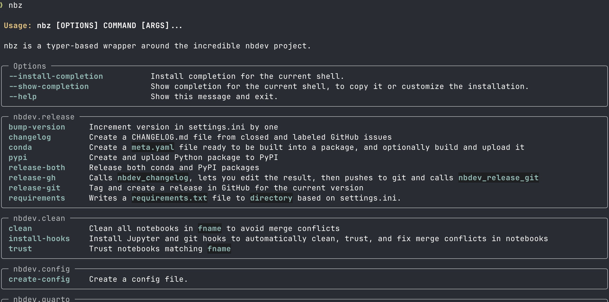

# nbz


<!-- WARNING: THIS FILE WAS AUTOGENERATED! DO NOT EDIT! -->



[Check out the video
demo](https://www.loom.com/share/5bbc2abcc73d45498be4259cb108dc64?sid=4b367d88-a20d-45d2-bea7-e569959e9e35)!

[nbdev](https://nbdev.fast.ai/) is an incredible software development
environment. You write code in notebooks and it exports the result to
Python flatfiles. It also handles documentation, version releases, and
so much more.

The goal of this project is to do the following, with items 2 and 3
being potential targets for upstream changes to nbdev:

1.  Wrap the nbdev command-line interface with
    [typer](https://typer.tiangolo.com/) to take advantage of some of
    the features of that framework (formatting, auto-completion, etc)
2.  Enhance the existing CLI documentation
3.  Add new features that may or may not fit in nbdev
4.  Provide an interface for other systems

## Developer Guide

If you are new to using `nbdev` here are some useful pointers to get you
started.

### Install nbz in Development mode

``` sh
# make sure nbz package is installed in development mode
$ pip install -e .

# make changes to cli.py
# TODO: explore moving code in nbz/cli.py to nbz/core.ipynb
# ...

# compile to have changes apply to nbz
$ nbz 
```

## Usage

### Installation

Install latest from the GitHub
[repository](https://github.com/pydanny/nbz):

``` sh
$ pip install git+https://github.com/pydanny/nbz.git
```

COMING SOON: or from [conda](https://anaconda.org/pydanny/nbz)

``` sh
$ conda install -c pydanny nbz
```

COMING SOON: or from [pypi](https://pypi.org/project/nbz/)

``` sh
$ pip install nbz
```

### Documentation

Documentation can be found hosted on this GitHub
[repository](https://github.com/pydanny/nbz)’s
[pages](https://pydanny.github.io/nbz/). Additionally you can find
package manager specific guidelines on
[conda](https://anaconda.org/pydanny/nbz) and
[pypi](https://pypi.org/project/nbz/) respectively.

## How to use

Once installed, you can call help by typing out `nbz` at the
command-line or `!nbz` in a notebook cell:

``` plaintext
Usage: nbz [OPTIONS] COMMAND [ARGS]...

 nbz is a typer-based wrapper around the incredible nbdev project.

╭─ Options ─────────────────────────────────────────────────────────────────╮
│ --install-completion          Install completion for the current shell.   │
│ --show-completion             Show completion for the current shell, to   │
│                               copy it or customize the installation.      │
│ --help                        Show this message and exit.                 │
╰───────────────────────────────────────────────────────────────────────────╯
╭─ nbdev.release ───────────────────────────────────────────────────────────╮
│ bump-version     Increment version in settings.ini by one                 │
│ changelog        Create a CHANGELOG.md file from closed and labeled       │
│                  GitHub issues                                            │
│ conda            Create a meta.yaml file ready to be built into a         │
│                  package, and optionally build and upload it              │
│ pypi             Create and upload Python package to PyPI                 │
│ release-both     Release both conda and PyPI packages                     │
│ release-gh       Calls nbdev_changelog, lets you edit the result, then    │
│                  pushes to git and calls nbdev_release_git                │
│ release-git      Tag and create a release in GitHub for the current       │
│                  version                                                  │
│ requirements     Writes a requirements.txt file to directory based on     │
│                  settings.ini.                                            │
╰───────────────────────────────────────────────────────────────────────────╯
╭─ nbdev.clean ─────────────────────────────────────────────────────────────╮
│ clean            Clean all notebooks in fname to avoid merge conflicts    │
│ install-hooks    Install Jupyter and git hooks to automatically clean,    │
│                  trust, and fix merge conflicts in notebooks              │
│ trust            Trust notebooks matching fname                           │
╰───────────────────────────────────────────────────────────────────────────╯
╭─ nbdev.config ────────────────────────────────────────────────────────────╮
│ create-config    Create a config file.                                    │
╰───────────────────────────────────────────────────────────────────────────╯
╭─ nbdev.quarto ────────────────────────────────────────────────────────────╮
│ docs             Create Quarto docs and README.md                         │
│ install          Install Quarto and the current library                   │
│ install-quarto   Install latest Quarto on macOS or Linux, prints          │
│                  instructions for Windows                                 │
│ prepare          Export, test, and clean notebooks, and render README if  │
│                  needed                                                   │
│ preview          Preview docs locally                                     │
│ proc-nbs         Process notebooks in path for docs rendering             │
│ readme           Create README.md from readme_nb (index.ipynb by default) │
│ sidebar          Create sidebar.yml                                       │
╰───────────────────────────────────────────────────────────────────────────╯
╭─ nbdev.cli ───────────────────────────────────────────────────────────────╮
│ filter           A notebook filter for Quarto                             │
│ new              Create an nbdev project.                                 │
│ update-license   Allows you to update the license of your project.        │
│ watch-export     Use nb_export on ipynb files in nbs directory on changes │
│                  using nbdev config if available                          │
╰───────────────────────────────────────────────────────────────────────────╯
╭─ nbdev.merge ─────────────────────────────────────────────────────────────╮
│ fix              Create working notebook from conflicted notebook nbname  │
│ merge            Git merge driver for notebooks                           │
╰───────────────────────────────────────────────────────────────────────────╯
╭─ nbdev.migrate ───────────────────────────────────────────────────────────╮
│ migrate          Convert all markdown and notebook files in path from v1  │
│                  to v2                                                    │
╰───────────────────────────────────────────────────────────────────────────╯
╭─ nbdev.test ──────────────────────────────────────────────────────────────╮
│ test             Test in parallel notebooks matching path, passing along  │
│                  flags                                                    │
╰───────────────────────────────────────────────────────────────────────────╯
╭─ nbdev.sync ──────────────────────────────────────────────────────────────╮
│ update           Propagate change in modules matching fname to notebooks  │
│                  that created them                                        │
╰───────────────────────────────────────────────────────────────────────────╯
╭─ Not yet implemented ─────────────────────────────────────────────────────╮
│ export           Not yet implemented                                      │
│ export-cli       Not yet implemented                                      │
╰───────────────────────────────────────────────────────────────────────────╯
```

To call one of these commands, call it as `nbz COMMAND`. So to create a
new notebook you would type:

``` sh
mkdir my-project
cd my-project
nbz new
```
